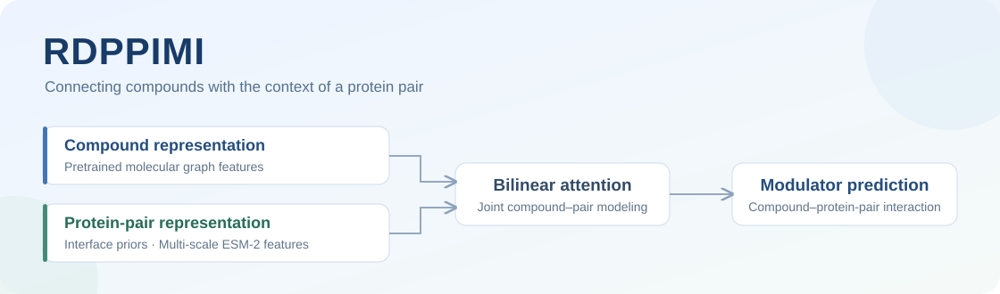

<div align="center">



**Interface priors and multi-scale protein representations for protein–protein interaction modulator prediction**

[](https://github.com/Yongji0427/RDPPIMI/releases/tag/v1.0-rdppimi-s4-3b)
[](#overview)
[](#released-results)

[Overview](#overview) · [Results](#released-results) · [Model weights](#model-weights) · [Get started](#get-started) · [Release scope](#release-scope)

</div>

## Overview

A protein–protein interaction modulator is evaluated against a protein pair. The prediction therefore needs to connect a compound's molecular features with the context of the queried interaction.

RDPPIMI combines ProteinShake-derived interface priors with representations from multiple ESM-2 scales to construct protein-pair features. Cross-scale reverse distillation organizes these representations, and a bilinear attention network integrates the resulting protein-pair features with pretrained molecular graph features for PPIMI prediction.

This repository provides the downstream model, interface-prior utilities, and the **S4–3B five-fold model release**. The released checkpoints use precomputed weighted protein-pair features.

## Released results

The released configuration uses **S4 cold-pair evaluation**, **3B weighted-pair RD features**, and one shared training configuration across five folds. Each checkpoint is selected by its fold's maximum validation AUROC.

| AUROC | AUPR | Sensitivity | Precision | Specificity |
|:---:|:---:|:---:|:---:|:---:|
| **0.8024 ± 0.0820** | **0.7640 ± 0.1187** | 0.9146 ± 0.0459 | 0.7117 ± 0.0989 | 0.6193 ± 0.1539 |

Values are five-fold means ± standard deviations. Sensitivity is recall. Threshold-dependent metrics follow the released implementation's per-test-set F1-optimal threshold. See [complete results and training settings](docs/RESULTS.md) for the original precision, individual folds, and additional metrics.

## Model weights

Download the checkpoints and supporting files from [**release v1.0-rdppimi-s4-3b**](https://github.com/Yongji0427/RDPPIMI/releases/tag/v1.0-rdppimi-s4-3b).

| Asset | Purpose |
|---|---|
| `rdppimi-s4-3b-weighted-pair-fold{1–5}-best.pt` | Five fold-specific RDPPIMI checkpoints |
| `proteinshake-ppi-esm2-35m-final.pt` | ProteinShake PPI interface-prior model |
| `graphmvp-molecular-encoder-init.pt` | Pretrained molecular encoder initialization |
| `rdppimi-s4-3b-weighted-pair-minimal-assets.tar.gz` | Supporting precomputed assets for the released configuration |
| `rdppimi-s4-3b-weighted-pair-run-configs.tar.gz` | Shared training configuration and fold-specific records |
| Results, grid registry, and `SHA256SUMS.txt` | Result records and integrity checks |

## Get started

### 1. Install the code

```bash
git clone https://github.com/Yongji0427/RDPPIMI.git
cd RDPPIMI
python -m venv .venv
source .venv/bin/activate
pip install -r requirements.txt
export PYTHONPATH="$PWD/src${PYTHONPATH:+:$PYTHONPATH}"
```

Install PyTorch Geometric and RDKit builds compatible with your Python, CUDA, and operating system.

### 2. Download and verify the release

With the [GitHub CLI](https://cli.github.com/) installed:

```bash
gh release download v1.0-rdppimi-s4-3b \
  --repo Yongji0427/RDPPIMI --dir release_assets
python scripts/verify_release_assets.py \
  --asset-dir release_assets --skip-torch-load
```

The verifier checks the required files and their SHA256 values. Omit `--skip-torch-load` to also check that the model files load with PyTorch. See the [release reproduction guide](docs/REPRODUCE.md) for extraction, feature inputs, and checkpoint loading.

### 3. Explore the downstream entry point

```bash
python scripts/train_ppimi.py --help
```

Downstream training and evaluation require the appropriate MultiPPIMI fold definitions, compound and protein physicochemical features, pair manifest, and fold-specific weighted-feature registry. The README commands do not download all benchmark inputs or regenerate RD features.

## Release scope

The public snapshot includes **PPIMI downstream modeling**, **interface-prior processing**, **precomputed-feature consumption**, and **release verification**. RD loaders used for scaler fitting, scaler-training scripts, and recursive RD feature-construction code are currently excluded. Use the precomputed assets for the released model configuration.

```text
RDPPIMI/
├── assets/                         Project overview
├── docs/                           Reproduction guide and result records
├── scripts/                        Downstream training, prior utilities, verification
├── src/rdppimi/
│   ├── ppimi/                      Predictor, BAN, compound GNN, feature readers
│   └── proteinshake/               Interface-prior utilities
└── requirements.txt
```

| Entry point | Function |
|---|---|
| `scripts/train_ppimi.py` | Train and evaluate the downstream PPIMI model |
| `scripts/export_softmax_pooling_weights.py` | Export residue-pooling weights |
| `scripts/merge_proteinshake_residue_scores.py` | Merge ProteinShake residue-score tables |
| `scripts/validate_weighted_pooling.py` | Check weighted-pooling inputs |
| `scripts/verify_release_assets.py` | Verify release files and checkpoints |

Questions about the released code or assets can be raised in [GitHub Issues](https://github.com/Yongji0427/RDPPIMI/issues).
